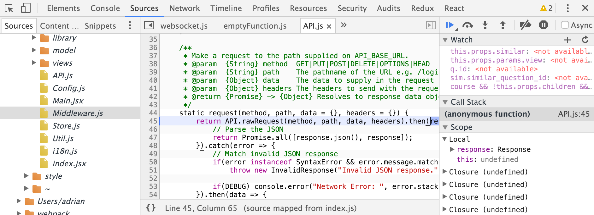

# Tools
Tooling was another extremely important part of the project. The philosophy was to use tools that increase development speed without too much abstraction. The reasons for the lack of abstraction is for a better understand of the inner workings of the app and to learn as much about the project as possible. This section gives a short overview of the tools used to create the project.

### Sublime Text and an IDE-less environment
At the risk of sounding highly pretentious, I enjoy the pureness of using a simple, plain-text editor (with syntax highlighting). The lighting quick Sublime Text works beautifully and stays out of the way allowing the code to take the forefront instead of the plethora of tools, popups and windows that clutter an IDE. All of the code for the project was written in 

### iTerm2 Command Line
*Everything* about this project can be built and run solely from the command line. As the developer of this project, this was an absolutely necessity for streamlining development, distribution and deployment. A good interface usd for the command line was [iTerm2](http://iterm2.com/), an open source terminal environment. Some of the more useful commands for the project:

|               Command         |          Result         |
|-------------------------------|-------------------------|
| `$ docker-compose up`         | Deploy the application. |
| `$ npm run dev`               | Start the development server with live reloading. |
| `$ python init.py`            | Start the python server.       |
| `$ py.test`                   | Run all API tests for the server. |
| `$ http localhost:5000/login` | Perform complex HTTP queries against the server. |
| `$ psql exp`                  | Open an SQL query interface to the database. |
| `$ git commit -m "..."`        | Commit code into the version control. |

### Documentation

To access documentation in the fastest manner possible, a fantastic application called <a href="https://kapeli.com/dash">Dash</a> was used in excess. A simple keyboard shortcut <code>⌘+⇧+Space</code> would bring up an interface to access all the docsets for the libraries and frameworks used in the project. It saved, with a confident estimation, about 40% of the would-be time spent looking through documentation for the project. This tool was <i>necessary</i>.

### Node.js and npm
The server-side logic for the project was written in Python however Node.js and it's package manager were a major part of the project's toolchain. Most, if not all, of the code transforming, linting and development tools are all written in Javascript for use with Node.js. It is critical to the build step of the client side code. It's sister, npm, is the package manager that installs these tools and runs them via it's `npm run-scripts` interface.

### Virtualenv and managing Python's dependencies
Python has a problem with dependencies and its package management system, `pip`. Unlike how npm works, each dependency is installed in a global location for every Python project. As a consequence, it makes for a painful experience trying to install different versions of the same dependency. For this exact reason, Virtualenv was created. Virtualenv allows you to install dependencies on a project basis where they no longer clash with versions.

### Chrome and Dev Tools
Another critical piece of tooling for the project was Chrome and it's Dev Tools. They are unmatched in their feature set, performance and usability. The time saved in debugging using their Source tab is immeasurable and without it, Javascript would be back in the Stone Age (figuratively speaking).

<i>Example of debugging a web request within the projects source code with Chrome Dev Tools.</i>

### Notable Mentions
Other tools which proved extremely useful:

* `psql` - PostgreSQL's SQL query interface.
* `py.test` - Py.Test test runner tool. See Testing chapter.