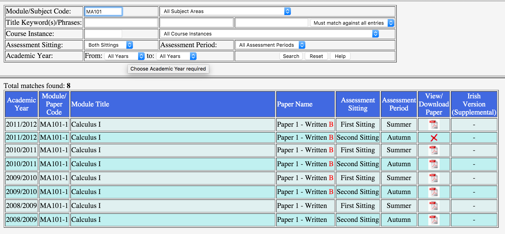
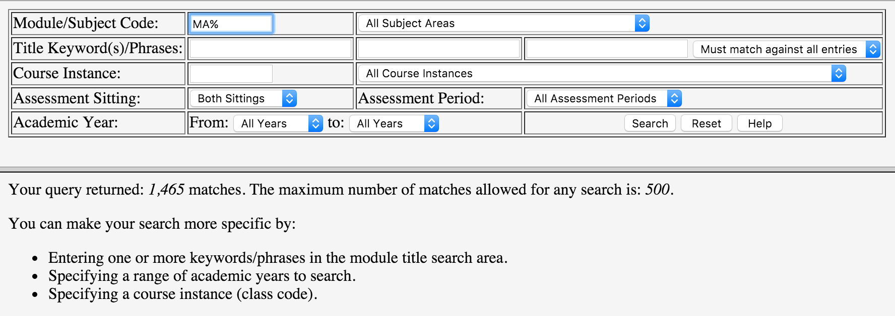

# Downloading Papers
Before work on the exam papers could begin, data on the paper was required. One of the core problems this application was built to fix is the extremely poor accessibility of exam papers online via the student portal. The interface is outdated, clunky and slow. It goes down entirely for a 30 minute period of time daily for "maintenance" which is very frustrating for students especially during exam time. With this in consideration, manual downloading of exam papers was not an option.

## Courses
To build our database of all courses and papers available, a starting point was needed to serve as the foundations for the extraction. This starting point was the list of course category codes (the prefix before any course code e.g. "MA" in MA207) provided in the contents of the dropdown menu within the search from on the online portal. It provided data which looked like:

    name,code
    "Accountancy",AY
    "Anaesthetics",AE
    "Anatomy",AN
    "Anatomy / Physiology",AP
    "Ancient Classics",AC
    "Applied Computing & Information Technology",CI

The project now had a list of all possible course categories from the online portal, now it needed to obtain a list of individual courses and their papers. To complete this task, the handy (but not particularly useful) feature of the search function on the online portal was exploited:

> Module/Subject Code - A module code (e.g., MA100), **part of a code (e.g., FR2% for all second year French modules)**, or an entire subject area as defined by the first part of each module code (e.g., PI for Philosophy).

The search term could contain a wildcard "%" which would expand our query to find related modules within a category, similar to the SQL `LIKE` function. This meant the scraper could input "MA%" into the search and return all papers for  courses with the prefix "MA" in order, for example "MA100" and "MA101". Queries like these would match all courses with the prefix thus all papers for those courses which result in huge collections of papers ("MA%" return 1,456 papers). 

Unfortunately (however understandable from a performance point of view), the system had a limit of returned results from any query. A maximum of 500 papers would be returned from each query. This forced things to be more complicated on the scraping end.

The portal's limit on results forced the scaper to decompose it's query into the search box to return less that 500 results. To decompose the query, it simply added another character in front of the category code to reduce the search scope and then repeated the search with the wildcard. For example, "MA%" would be converted to "MAA%". Once the query was decomposed enough, it would cycle through the characters alphabetically including digits "MAA%", "MAB%", .. "MA9%", "MA0%" until results were obtained from the portal.

Finally, results were returned from the portal but would be trapped within a poorly formatted HTML table. A HTML parser called `BeautifulSoup` for python was used to load up the HTML and perform DOM selections and data extraction. Each table row represented a paper and each cell had information about the paper. This extraction method was fragile because of the inconsistent HTML returned but the only option available. Some shaky logic were used to describe the paper such as the presence of an anchor element within a table cell told the scraper if the paper was available online or not.

Once all the data was extracted from each search result page for every module category, it allowed the project to build a database of modules and their papers. Links to the PDF contents could be derived from the data by using the URL pattern provided:

    https://www.mis.nuigalway.ie/papers_public/
        {year}/{module_category}/{year}_{module_code}_{sitting}_{period}.PDF

The scraper managed to collect **19,634** papers across **2,904** courses, completely scanning the portal in less than *15 minutes*. This newly collected database allowed the project to stay away from the online portal and not use up unnecessary server resources or perform useless requests.