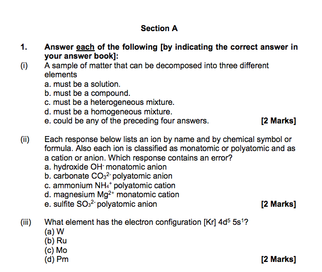

## Appendix: Exam Paper Specification
#### Page 1
Page one describes the instructions for the paper, usually with the following format with a high consistency rate between papers (seen on all). Example below with sample strings in square brackets:

                Title [Semester 1 2014 / 2015]
                
        Exam Code(s)             [XX000, XX000, ...]
        Exam(s)                  [1st Engineering]
        Module Code(s)           [CH140, ...]
        Module(s)                [Engineering Chemistry, ...]
        External Examiner(s)     [Professor Tim Gallagher
                                  ...]
        Internal Examiner(s)     [Professor P.V. Murphy
                                  *Dr. P. O’Leary
                                  ...]
        INSTRUCTIONS:            [Answer Four questions:
                                  Question one must be attempted (-0.5 for incorrect
                                  answer)
                                  Three other questions must be attempted
                                  Separate Answer Books are not required for each section.
                                  All questions carry 25 marks distributed as shown.
                                  Leave the front page of the Answer Book blank and clearly
                                  list on it the numbers of the questions attempted.]
                                  
        Duration                 [2hrs]
        No. of Pages             [6 (including this front page)]
        
        Department(s)            [Chemistry]
        Requirements             [None]
        
        
                 [Optional note...]
                 
#### Page $n+1$
All ensuing pages contain questions. See formal defintion below of a *question*.

### Deviations
#### Sections
Some exam papers, for example CH140 Engineering Chemistry, Paper 1 Written, 2014/2015 are split into sections.

## Exam Question Specification
### Types of questions
#### 1. Simple question
A *simple question* is a single or multi line text blurb. It does not have to end with a question mark. It does not require an index. It can follow with marks for the question in the form of `(X)`, `[X]` or any variant.

Definition:

    simple_question = [blurb] mark?
    mark = round_mark / square mark
    round_mark = "(" [0-9]+ ")"
    square mark = "[" [0-9]+ "]"
    
Example:

    How did the arsonist get round shaped feet? (20)
    
#### 2. Multiple Choice Question
A *multiple choice question* is a *simple question* followed by an indexed list of answers. For types of indexing, see below.

Definition:

    multiple_choice_question = simple_question answer+
    answer = index [blurb] mark?
    
Example:

    How many questions is there in a short question question? (2)
        (a) This answer.
        (b) OR this answer.
        (c) OR, HEY LISTEN, this answer.
        
This allows us to define `question`:

    question = multiple_choice_question / simple_question
    

#### 3. Indexed Question
An *indexed question* is a *question* that has an *index*. For types of indexing, see below.

Definition:

    indexed_question = index question

Examples:

    A. How many example questions would a question like this have? (5)
    B. How many marks should a question like this be worth? (5)
    C. What time is it? (20)

#### 4. List question
A list question is a question that has mutiple sub-questions. A blurb header describes the question or gives instructions on how to answer the sub-questions. Sub-questions are a list of *indexed questions*. A list question can also have an index.

Defintion:
    
    list_question = index? simple_question indexed_question+

Example:

    N. Lorem ipsum dolor sit amet, et amet iudico alterum vim, ea pro molestie copiosae mediocritatem. Ei has graeci percipitur mediocritatem, eius illum omnes te sea. Mei accusata adversarium at, cetero impetus prodesset vis ea. Sit amet moderatius ad.
    
        A. How many example questions would a question like this have? (5)
        B. How many marks should a question like this be worth? (5)
            (a) This answer.
            (b) OR this answer.
            (c) OR, HEY LISTEN, this answer.
        C. What time is it? (20)

### Indexing
Indexing in exam papers is highly inconsistent. Questions can use different forms of numbering within the same exam paper.

* Decimal - Usually for the main questions.
* Letters (A, b) - Normally for sub questions or multiple choice, uppercase or lowercase.
* Roman (i, ii, iii) - Normally for sub questions

Definition:

    index = prefix? round_index / square_index / dot_index / types
    
    prefix = "Question" / "Q." / "Q"
    
    round_index = "(" types ")"
    square_index = "[" alphabet "]"
    dot_index = types "."

    types = demical / alphabet / roman
   
    decmial = [0-9]+
    alphabet = [a-zA-Z]
    roman = [roman numeral]
    
Examples:

    a.
    A.
    (A)
    [1]
    Q1
    Question 1
    Question i
    iii
    iv
    
    
