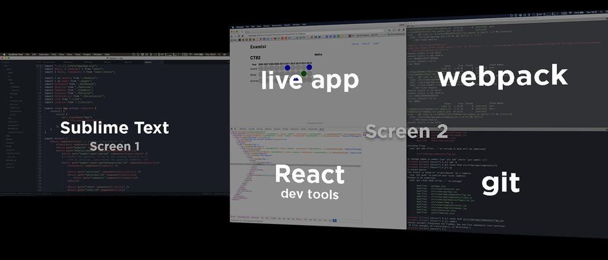

## 4.3 Workflow
The development workflow the project was designated between a couple of tools. Each of these tools served their own unique process and were fundamental to the process.

### Client
#### npm Scripts
To run any aspect of the client, the `npm run-script` facility was used heavily instead of build tool such as Gulp or Grunt. It offered a lightweight way to write the scripts to build the client aswell as running those scripts. For example, to build the production version of the application, the npm script uses the locally installed webpack to build:

```json
"scripts": {
	"build": "webpack",
	"build-production": "NODE_ENV=production npm run build"
}
```

And to run, navigate to the `client/` directory and execute:

	$ npm run build-production
	
#### Webpack
Webpack is how the client side is bundled together into a single file. Webpack takes the dependency tree and creates an environment in the browser where all they dependencies are imported correctly and synchronously. The unminified build of the application collects over 1200+ separate Javascript files and combines them into a single, *huge* 3mb worth of code file. Serving the javascript in that form is a serious user experience failure because of the load time before anything is shown on the screen. The following optimisations have yet to be added:

 * Using production builds of the libraries.
 * Minification.
 * Remove development and debugging code.
 * Google closure compiler.

This process should cut the size of the code down by half and then other techniques such as gzipping and code-splitting (loading the code on demand) should bring it down to a reasonable size.

#### Hot Reloading
Building and refreshing the page becomes very tedious when trying to develop components deep down within multiple layers of user interaction in the app. This is where *Hot Module Replacement* feature in Webpack is works a dream. With a local development server, Webpack will watch for changes in the file system, pick up any changes made to the application and send down the newly updated module over a socket to the app to update in realtime. The *React Hot Module Reloader* builds on this technology to allow components to update their render methods and perform a re-render, all while maintaining the application tree and state. It's essentially a highly complicated live-reloading technique for modern Javascript applications.

To start the client development server with hot reloading, run the following command:

	$ npm run dev


<center><i>The tools combined, working concurrently on the home workstation.</i></center>

### Server
The workflow of the server was fairly simple. First, we had to enter the virtualenv of the project. On the local machine, this was called `fyp`. Using the `workon` command, the project's virtualenv was activated and all dependencies required for the project would resolve correctly.

	$ workon fyp
	
As you will read later in the Deployment chapter, the server requires *environment variables* to understand how to connect to the database and othe configuration. The standard practice is to create a `.env` file in the `server` directory (that's **not checked into source control**) and specify the contents of the variable. We use the `export` function to persist the variables for the current shell session. See the `config.py` for a list of environment variables that can configure the app. The contents of the local `.env`:

```sh
export DB_USER=adrian
export DB_PASS=root
export DB_NAME=exp
export APP_DEBUG=True
```

And then `source` those vars:

	$ source .env

Finally, the server needs to be started. Flask has an inbuilt debug mode that will automatically restart the server on any changes. To start the server, ensure the `APP_DEBUG` flask is true and run the following command:

	$ python init.py

This, in combination with the client development server locally, deploys a fully functioning web app on the host system that reacts to changes in the application automatically.