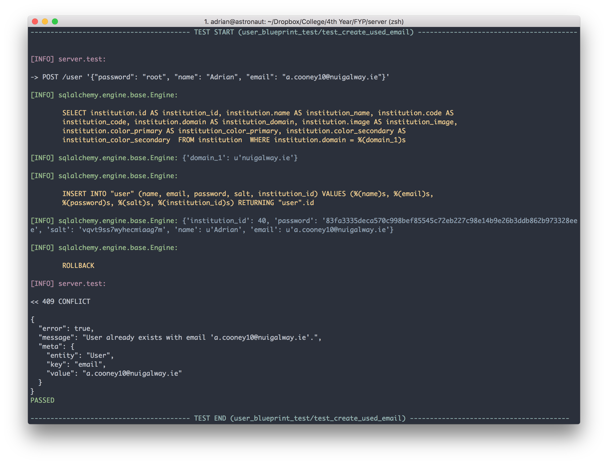
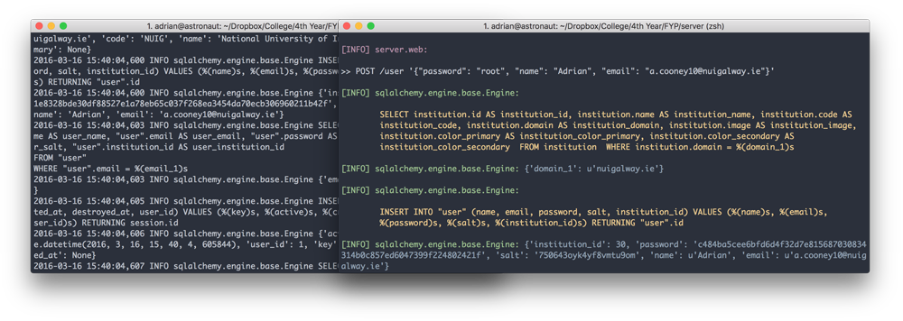

# Testability
Testing for me is the foundation of software development. Without it, code is written in fear and defense which makes for an unproductive and wasteful environment. Bugs and regressions can go unnoticed and bite when it's least expected which leads to wasted time down a rabbit hole of git logs and downgrading.

## Backend
The API has a large suite of tests to ensure any changes to models or blueprints don't break anything. Whenever a change is made to any part of the codebase, the entire suite of tests must be run to check each endpoint is returning the data is supposed to. For each endpoint within the app, there is an average of 3 tests that ensure to test three things:

1. **A request with invalid parameters fails.**

   These are usually POST or PUT requests that send data to the server. The body of these requests must follow a strict schema and each field must have the correct data type. This includes parameters within the endpoint's URL itself. These tests are designed for security purposes to prevent SQL injection and meddling with parameters that are not publicly accessible. 

2. **A request with invalid data fails.**

   Again, these are usually POST or PUT requests that send data to the server intending to be processed in some way. The endpoint has to be tested to ensure the integrity of the existing data is not compromed by incoming valid data. Examples are when trying to create new users when an email already exists for that user or trying to update an entity that voilates a constraint within the database.

3. **The response returned the correct data.**

   Probably the most important test of the three is that given a valid request, the API returns the expected data. This is to ensure that interfaces built for the API can trust the server to always return data in the same format and structure.

### Fixtures
The key to testing an application is making it easy to write good tests. Tests should be simple, complete and deterministic. When writing a test takes longer than writing the implementation of the code being tested, something is wrong. To avoid that trap and make writing tests as easy as possible for the API, the test suite made heavy use of Py.Test fixtures.

Fixtures are methods, that when called, perform some setup for the test suite. This includes connecting the database, creating the tables, importing sample data and generally laying down the foundations for tests so that they can act upon real data. 

The fixtures are designed to have zero side effects. This means that any database commits or file changes *always* rollback their changes to the initial state. Now, every time a fixture is required, the test can expect a clean slate. Fixtures can be scoped to the "session" or "function". The session scope turns the fixture into a singleton that when required first is executed and all following uses have the same value. This is useful for setting up the database connection and creating the tables which needs to be done only once per testing session. The function scope forces the fixture to be executed every time a test unit requires the fixture, this is useful for using SQL Alchemy's Session object and rollback any changes made to the database during that test.

#### Sample Test

```python
def test_profile_delete_course(auth_client, user_with_courses, session):
    existingCourse = user_with_courses.courses[0]
    resp = auth_client.delete("/profile/courses", 
        data={ "course": existingCourse.id })

    assert_api_success(resp)

    session.refresh(user_with_courses)
    assert len(user_with_courses.courses) == 4
    assert not find(user_with_courses.courses, 
        lambda mod: mod.id == existingCourse.id)
```

Above we have an example test `test_profile_delete_course` which sends a request to the API attempting to remove a course from a user's associated courses. From the method arguments, we can see it uses three fixtures (Py.Test automatically resolves the arguments to fixtures when it runs the test): `auth_client`, `user_with_courses` and `session` (for a full list of fixtures, see Appendix 1: Test Fixtures). 

The `auth_client` provides an API client that has a logged in session and user associated with it and any requests made are authorized. This saves the hassle of having to write login code for every test (if I wanted an unauthorized client, I'd ask for the `client` fixture). The `user_with_courses` fixture returns a user with courses associated at "function" scope and committed to the database. Finally, the session object is an SQL Alchemy Session object we can use to query the database to ensure any changes made by the API exist in the database.

The first two lines of the test used the auth client to make a *DELETE* request to `/profiles/courses` with the ID of a course that a user has associated. We want to remove that course from the user's associated courses.

Next, we `assert_api_success` which checks that the API returned a `200 OK` and the standard success response. If it doesn't, it will raise an `AssertionError` and the test will fail. Finally, we make sure the change has persisted to the database by refreshing the `User` entity and ensuring the course is not associated anymore.

When the test is complete, *everything* is rolled back to the state before the test started including the user's login session created for the `auth_client` and the new user and their courses created in the `user_with_courses`. If any following tests require those fixtures, everything has to be recommited to the database from scratch again. This may seem cumbersome and slow however it is the best way to ensure that every test will not be negatively affected by unintended side effects.

### Assertions
TODO

### Logging
Since the development workflow of the backend is mostly TDD (Test Driven Development), it's important that the output and logs of the code being tested is easily accessible to ensure the code is performing as it should. For the test suite, a lot of effort was put into ensuring the log output was as readable and approachable as possible. There was a couple of steps involved in reach the current state.



First off, Py.test does a poor job of reporting test execution. By default it surpresses any output unless the command line flag `-s` is enabled. Even with that, only a dot is inserted after the test has completed execution. The first change to the output was to mark the beginning and end of a test run using large, guarded markers with the test name.

The next modification to the logging output was making SQL Alchemy's SQL output readable. This was no easy task because SQL Alchemy spits out *huge* chunks, line by line which leads to unparsable walls of text. SQL Alchemy uses Python's native `logging` module which allows you to plug in your own formatters and filters. The SQL Alchemy logger was modified to colorize, indent and surround whitespace with any parameters shown just below it.



Finally, the last modification was only logging data that was relevant to the test. The fixtures produce _a lot_ of output such as SQL queries and any other function call and created *large* chunks of text before the test even started running. Py.Test unfortunately did not have the facility to turn off output from fixtures so a custom solution has to be built. From deep within the Py.Test docs, I found two "hooks" which would call a method before and after each test run called (`pytest_runtest_call`, `pytest_runtest_teardown`). From there, it was simply a matter of turning on and off the output from any loggers and isolate only the test output.

